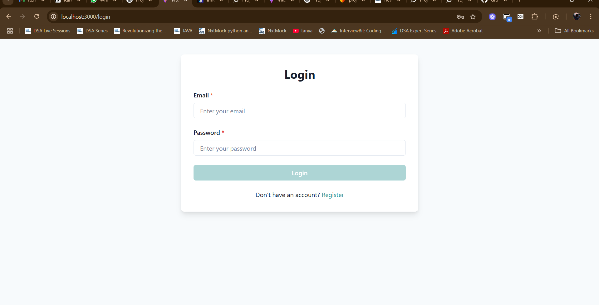
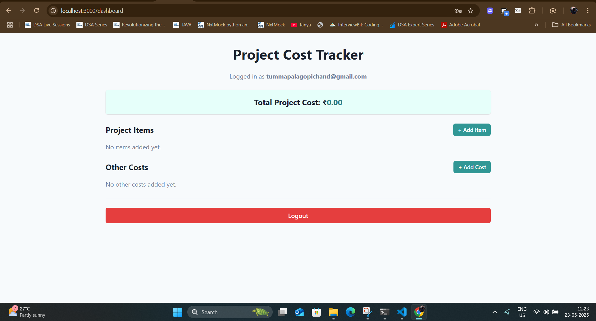
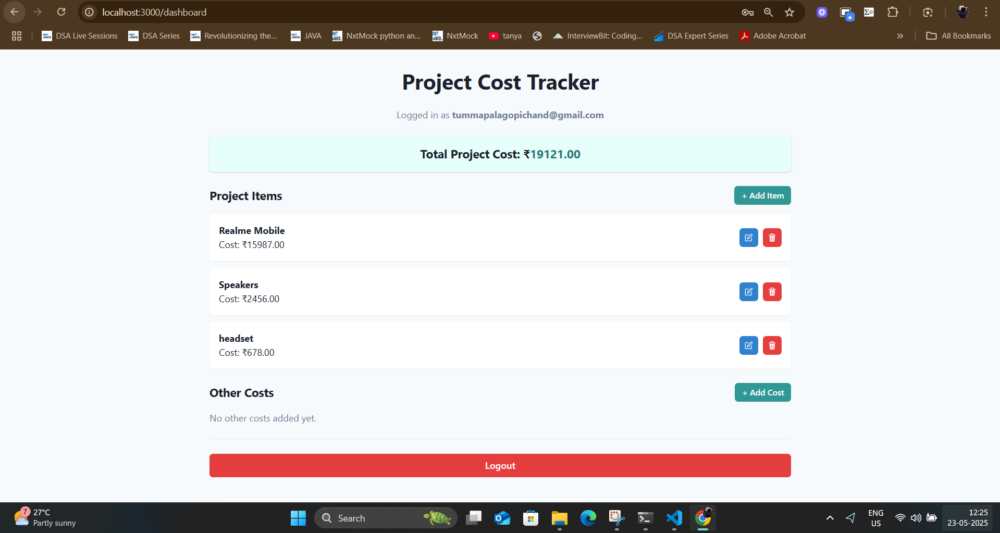
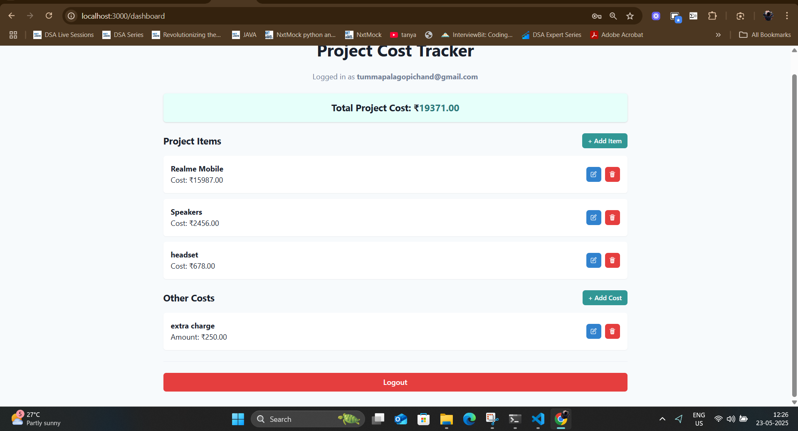
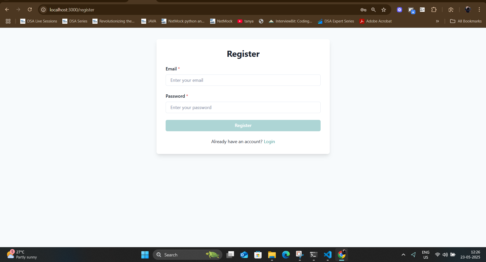

Absolutely. Here is a complete, professional, and personalized `README.md` file for your **Project Cost Tracker**, written from your perspective as the developer who implemented it.

---

### ✅ File: `README.md`

````md
# 🧾 Project Cost Tracker

A React + Firebase-based web application that helps users efficiently manage the costs involved in a project by tracking both items and other expenses. This was built as part of the Karkhana Internship Assignment.

---

## 🔍 Overview

The **Project Cost Tracker** allows authenticated users to:

- ✅ Add/Edit/Delete project **Items** (e.g., Laptop, Hosting)
- ✅ Add/Edit/Delete **Other Costs** (e.g., Shipping, Tax)
- ✅ Automatically calculate and display the **Total Project Cost**
- ✅ Securely log in and store their data in **Firebase Firestore**

The app is responsive, styled using **Chakra UI**, and manages state with **Redux Toolkit**.

---

## 🚀 Features Implemented

| Feature                         | Description                                                                 |
|-------------------------------|-----------------------------------------------------------------------------|
| 🔐 User Authentication         | Firebase Auth (Email/Password) with Login, Register, Logout flows           |
| 📦 Add/Edit/Delete Items       | Items have a name and a cost                                               |
| 🧾 Add/Edit/Delete Other Costs | Costs have a description and an amount                                     |
| 📊 Total Cost Calculation      | Sum of all item costs and other costs, updated in real-time                |
| 🔄 Real-Time Firestore Sync    | Data is saved per-user in Firebase Firestore using secure subcollections   |
| 🖥️ Chakra UI                   | Responsive UI with modals, form controls, toasts, and layout system        |
| 🧠 Redux Toolkit               | App state managed globally with slices and async thunks                    |

---

## ⚙️ Technology Stack

| Layer         | Technology / Tool         |
|--------------|----------------------------|
| Frontend     | React + Vite               |
| State Mgmt   | Redux Toolkit + Redux Thunks |
| Styling      | Chakra UI                  |
| Auth         | Firebase Authentication    |
| DB           | Firebase Firestore         |
| Notifications| Chakra `useToast`          |
| Deployment   | *(Pending: Vercel/Netlify)* |

---

## 🧑‍💻 How I Developed This

### 1. 🔧 Project Initialization

```bash
npm create vite@latest project-cost-tracker --template react
cd project-cost-tracker
npm install
````

### 2. 🛠️ Installed Dependencies

```bash
npm install @chakra-ui/react @emotion/react @emotion/styled framer-motion
npm install firebase
npm install @reduxjs/toolkit react-redux
npm install react-router-dom
npm install notistack
```

### 3. 🧱 Project Folder Structure

```bash
project-cost-tracker/
├── public/
├── src/
│   ├── firebase.js              # Firebase config and initialization
│   ├── pages/
│   │   ├── Login.jsx
│   │   ├── Register.jsx
│   │   └── Dashboard.jsx
│   ├── redux/
│   │   ├── store.js
│   │   ├── authSlice.js
│   │   ├── itemsSlice.js
│   │   └── otherCostsSlice.js
│   ├── App.jsx
│   └── main.jsx
```

### 4. 🔐 Firebase Setup (Authentication & Firestore)

* Created a Firebase project
* Enabled **Authentication** → Email/Password
* Created **Firestore** database with rules:

```js
rules_version = '2';
service cloud.firestore {
  match /databases/{database}/documents {
    match /users/{userId}/{document=**} {
      allow read, write: if request.auth != null && request.auth.uid == userId;
    }
  }
}
```

* Firebase config was saved in `src/firebase.js`.

---

## 🧪 How to Run the Project

### 🖥️ Development

```bash
git clone https://github.com/your-username/project-cost-tracker.git
cd project-cost-tracker
npm install
npm run dev
```

### 🌐 Deployment (Optional)

```bash
# Create a Vercel/Netlify account
# Link this repo
# Set environment variables (if used)
# Deploy and get your live URL
```

---

## ✅ Features Still To-Do (Optional Enhancements)

* [ ] Save Redux state to localStorage (offline support)
* [ ] Add date/timestamps for items and costs
* [ ] Charts for visualizing cost breakdown (e.g., pie chart)
* [ ] Sorting/filtering of items
* [ ] Move Firebase config to `.env` file for production

---

## 📸 Screenshots












---

## 🙋‍♂️ Developer

👨‍💻 **Name:** Gopi
🎓 **Assignment:** Karkhana Frontend Internship
📅 **Year:** 2025
📬 Email: *\[your email]*

---

## 📄 License

This project is for educational and assignment purposes only.

---

```

---

### ✅ Next Steps:

1. Save the above as `README.md` in the project root.
2. Replace placeholders like:
   - GitHub URL
   - Screenshots section
   - Your name/email (if needed)
3. Push it to GitHub and you're ready to share it professionally.

Would you like help deploying it to Vercel and linking that in the README as well?
```
